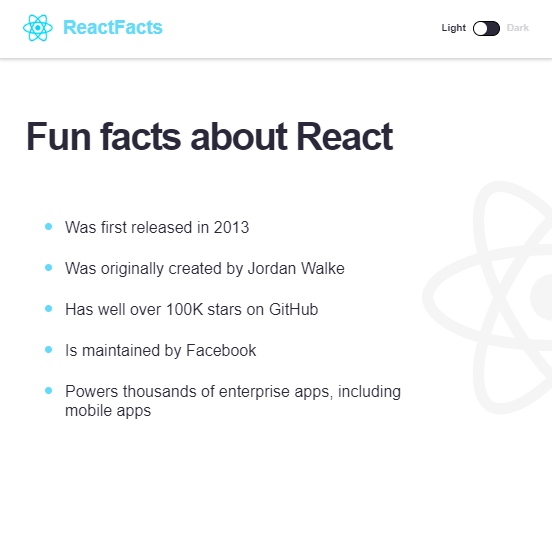
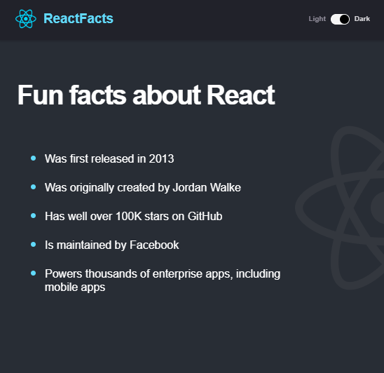
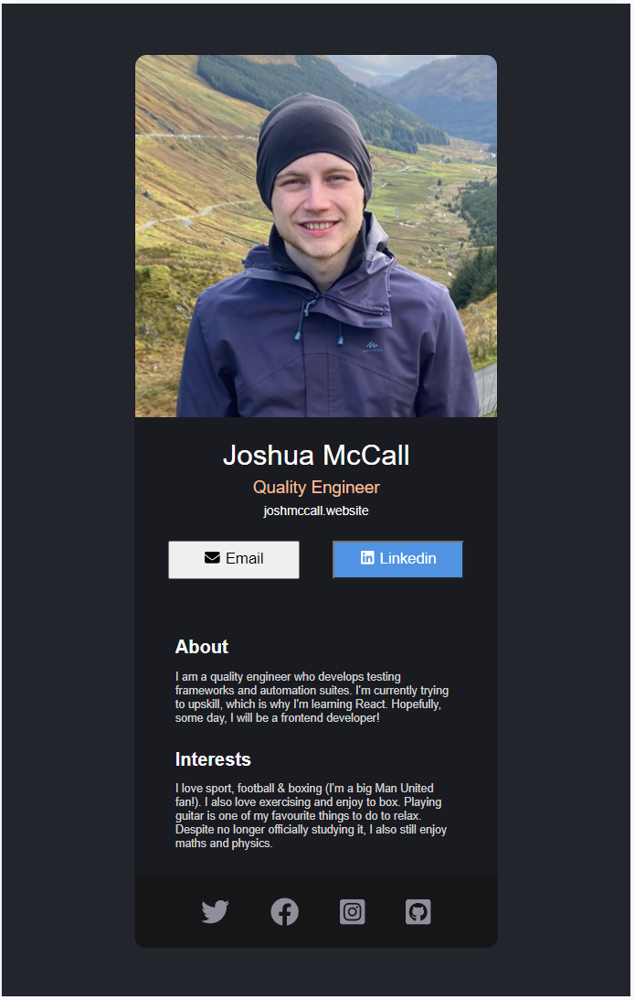
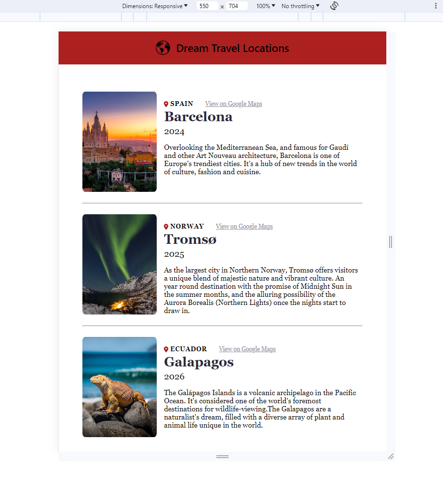
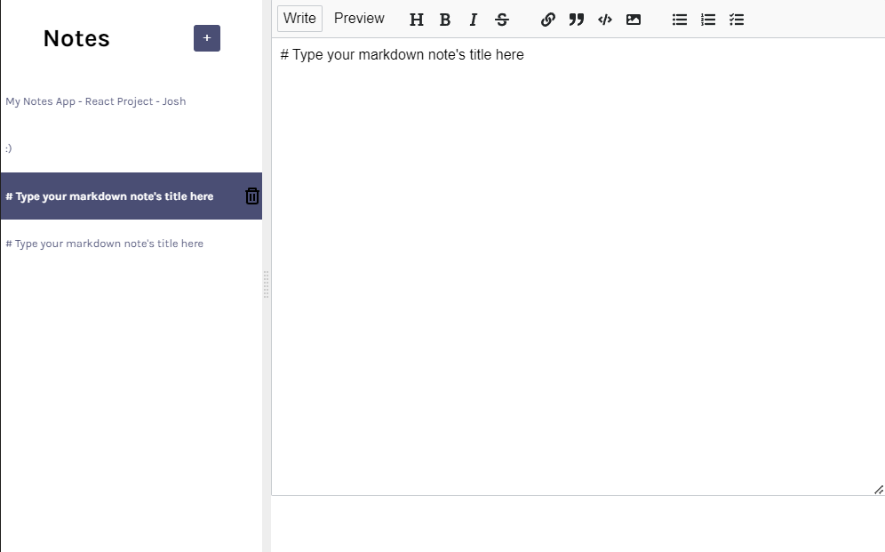
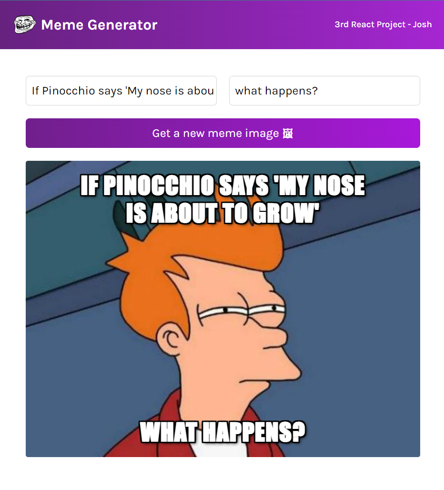
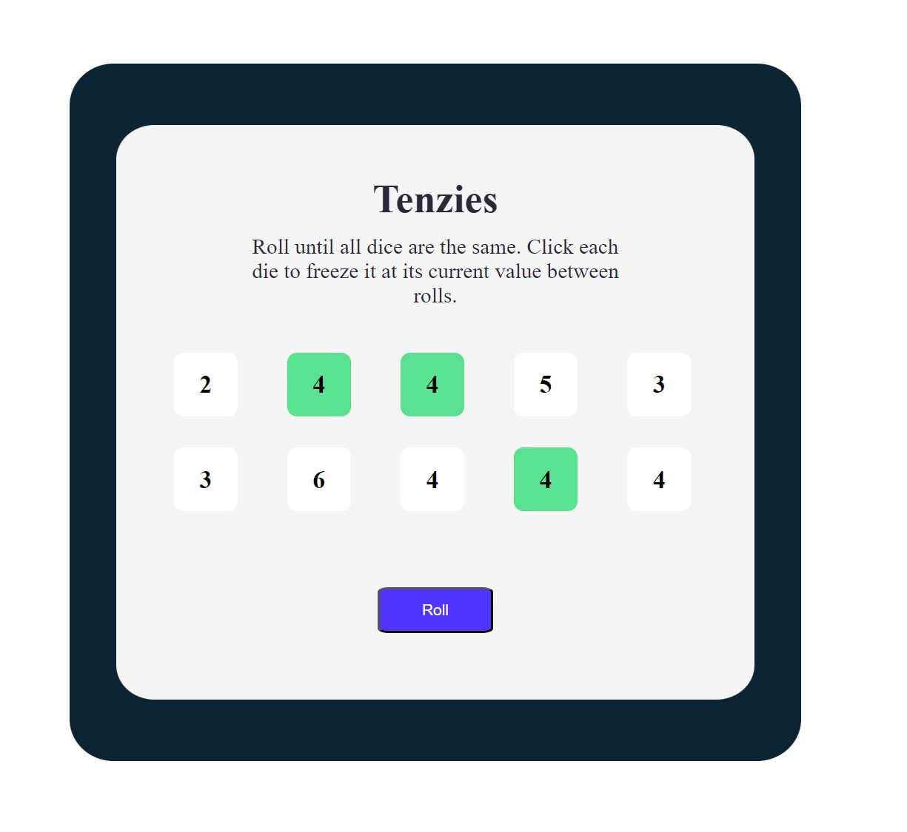
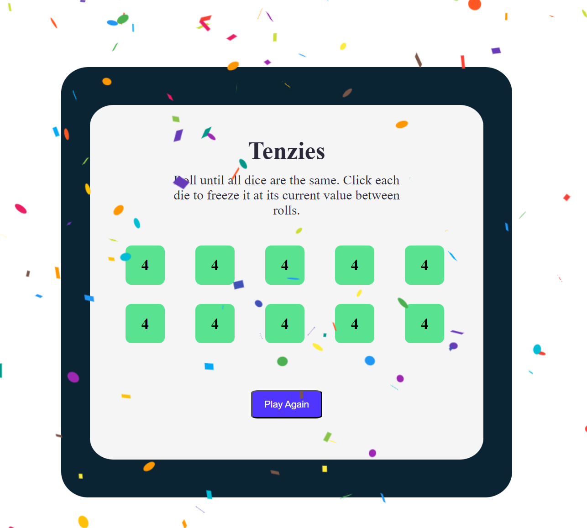

# Here are screenshots from each of the projects   - All project designs were based on a design file-
 
 

## Project 1: React Facts Page

 
 

**Light Mode:**
 
 

 
 

**Dark Mode:**
 
 

 
 

## Project 2 (Solo): Digital Business Card
 
 

 
 

## Project 3 (Solo): Travel Journal
 
 

 
 

## Project 4: Notes App
 
 

 
 

## Project 5: Meme Generator
 
 

 
 

## Project 6 (Solo): Tenzies Game
 
 

**In Play:**
 
 

 
 

**Completed:**
 
 

 
 

